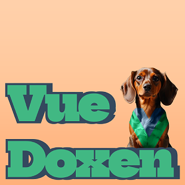

# vue-doxen

The world's best Vue.js component documentation tool!

* Designed specifically to work with Vue 3 components (exclusively)
* Fully customizable
* All CSS is optional
* Documentation lives in the component as code (or in separate object if preferred)
* Vue-Doxen is just a Vue componet, so it works anywhere a Vue component would work.
* Generates at runtime, so always up-to-date
* Doesn't require adopting an entire ecosystem or installing tons of dependencies, just use what works with Vue and you're good.

## Using the library

Go to the docs site for usage and installation steps:

* https://TheJaredWilcurt.com/vue-doxen

* * *

## Running this repo locally to make PRs

1. Uninstall Node/npm/nvm/nvm-windows/n/nodist
1. Install [Volta](https://volta.sh) (replaces all of the above and is much better)
1. Clone the repo
1. `npm install`
1. `npm run build` builds both the docs site and library
1. `npm run lint` checks for linting errors

### Project Structure

* **Documentation site**
  * `npm start` will launch the app for local development
  * Code lives in `app` folder
  * Uses `vite.config.docs.js`
  * `npm run build` will produce `docs` folder
* **Library**
  * To manually test/develop the library use the docs site via `npm start`
  * Code lives in the `lib` folder
  * Uses `vite.config.lib.js`
  * `npm run build` will produce `dist` folder
  * `npm t` runs unit tests for the library
